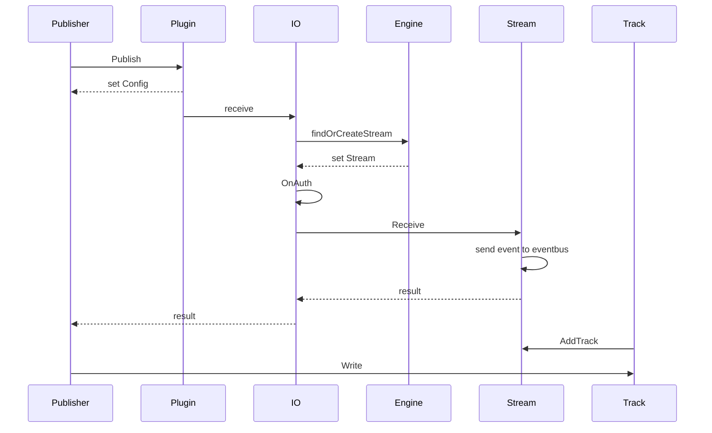
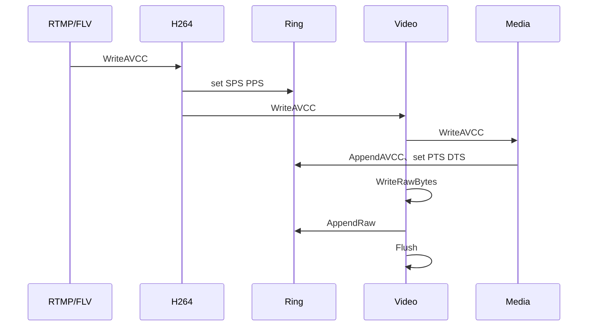
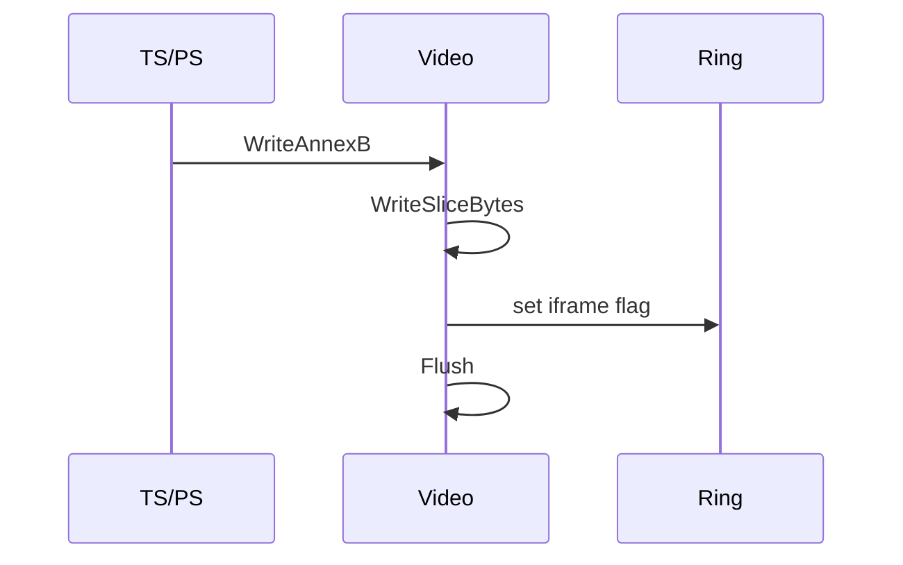
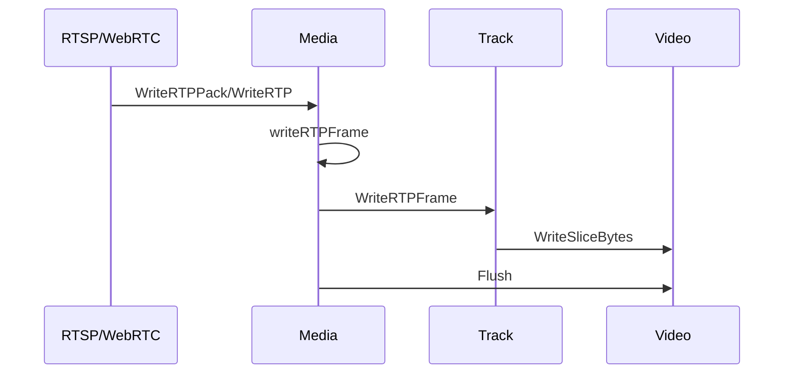
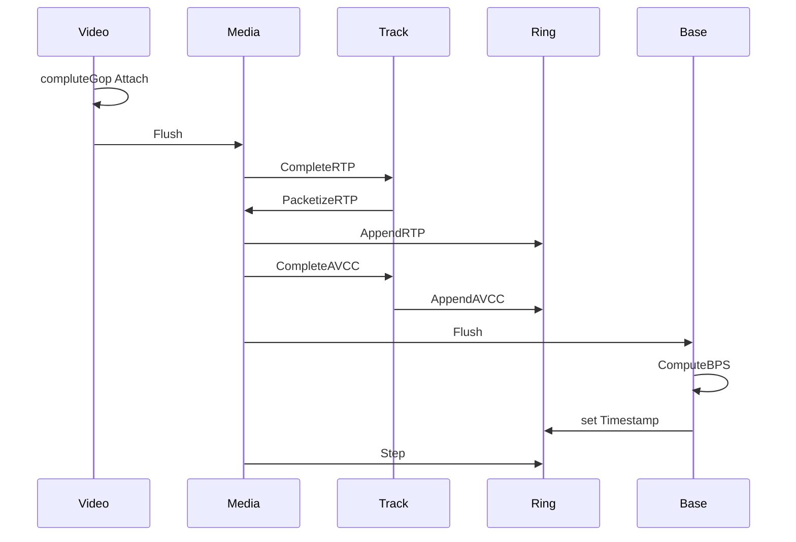
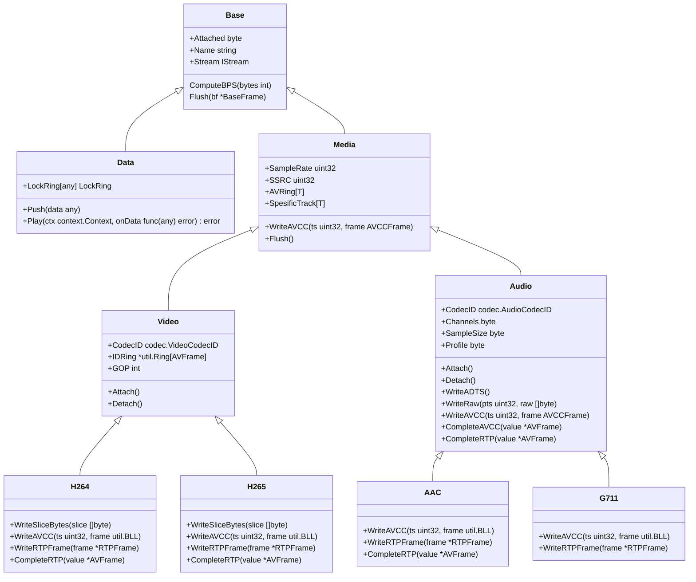

# Publisher

The function of the publisher is to insert audio, video, or other data into the engine. Video sources include streams received from the server, streams pulled from other servers, or data read from files.

:::tip
You can use the Publisher in the official plugin to learn how to use the publisher.
:::

## Publisher sequence diagram



## Define the publisher

Although `Publisher` can be used directly as the publisher, we usually need to define a custom structure containing `Publisher` to become a `Publisher` with specific functions.

```go
import . "m7s.live/engine/v4"

type MyPublisher struct {
  Publisher
}
```

By including `Publisher` in this way, the `IPublisher` interface is automatically implemented for the custom structure. Other desired properties can also be included in this structure.

## Define the publisher event callback

In v4, the event callback replaces all previous logic. The following events may be received:

```go
func (p *MyPublisher) OnEvent(event any) {
  switch v:=event.(type) {
    case IPublisher:// means successful publication
      if p.Equal(v) { // incumbent
        p.AudioTrack = p.Stream.NewAudioTrack()
        p.VideoTrack = p.Stream.NewVideoTrack()
      } else { // Use the track left by the previous one, because subscribers are all on the previous one
        p.AudioTrack = v.getAudioTrack()
        p.VideoTrack = v.getVideoTrack()
      }
    case SEclose:// means closed
    case SEKick://被踢出
    case ISubscriber:
      if v.IsClosed(){
        // subscriber left
      } else {
        // subscriber entered
      }
    default:
      p.Publisher.OnEvent(event)
  }
}
```
Usually, we directly delegate IPublisher, SEclose, and SEKick events to the Publisher to handle (by entering from default above). The internal code is as follows:

```go
func (p *Publisher) OnEvent(event any) {
	switch v := event.(type) {
	case IPublisher:
		if p.Equal(v) { // incumbent
			p.AudioTrack = p.Stream.NewAudioTrack()
			p.VideoTrack = p.Stream.NewVideoTrack()
		} else { // Use the track left by the previous one, because subscribers are all on the previous one
			p.AudioTrack = v.getAudioTrack()
			p.VideoTrack = v.getVideoTrack()
		}
	default:
		p.IO.OnEvent(event)
	}
}
```
## Start publishing

To publish, you need to register the publishing stream first, and then you can write audio and video tracks.

### Register the publishing stream (publish)

```go
pub := new(MyPublisher)
if plugin.Publish("live/mypub", pub) == nil {
  // registration succeed.
}

```

Once it is registered successfully, events will be received in `OnEvent`.

### Create audio and video tracks

After successful registration, a video track and an audio track will be automatically created:
The type is track.UnknowVideo and track.UnknowAudio.
Unknown means that the encoding format is unknown. For example, when using the rtmp protocol, the encoding format can only be determined after receiving the data, so it is appropriate to use this format.

If you know the encoding format of the audio and video tracks in advance, you can create a specific track type during creation, such as:

```go
import 	"m7s.live/engine/v4/track"
track.NewH264(pub.Stream)
track.NewH265(pub.Stream)
track.NewAAC(pub.Stream)
track.NewG711(pub.Stream,true) //pcma
track.NewG711(pub.Stream,false) //pcmu
pub.Stream.NewDataTrack(nil)//data track
```

### Register audio and video tracks

Audio and video tracks are automatically registered in the stream by calling the Attach method, and the video track is registered in the stream only after the first key frame is received. AAC needs to wait for the configuration information before being registered, and G711 is automatically registered when it is created.

For custom tracks that are different from the default tracks, the Attach method must be called to register them in the stream. (Note that a name that is different from the default track name should be set to prevent registration failure)

### Write track data

Once the tracks are available, audio and video data can be written to them. The following is the interface of audio and video tracks, you can see the methods we can call:

```go

type Track interface {
	GetBase() *Base
	LastWriteTime() time.Time
	SnapForJson()
	SetStuff(stuff ...any)
}

type AVTrack interface {
	Track
	PreFrame() *AVFrame
	CurrentFrame() *AVFrame
	Attach()
	Detach()
	WriteAVCC(ts uint32, frame util.BLL) error // Write data in AVCC format
	WriteRTP([]byte)
	WriteRTPPack(*rtp.Packet)
	Flush()
	SetSpeedLimit(time.Duration)
}
type VideoTrack interface {
	AVTrack
	WriteSliceBytes(slice []byte)
	WriteAnnexB(uint32, uint32, AnnexBFrame)
	SetLostFlag()
}

type AudioTrack interface {
	AVTrack
	WriteADTS([]byte)
	WriteRaw(uint32, []byte)
}
```

For different data formats, we can choose the corresponding writing method, for example, for `rtmp` format data, we use `WriteAVCC` to write;
RTP format data can choose to write through `WriteRTP` or `WriteRTPPack`.
For video, we can use `WriteAnnexB` to write in Annex B format, and audio can use `WriteADTS` to write `ADTS` header information.
For other types of data, we can first get the raw data and then use `WriteSliceBytes` to write it.

Internal process of `WriteAVCC`:


Internal process of `WriteAnnexB`:


Internal process of `WriteRTP` and `WriteRTPPack`:


Internal process of the second half of `Video.Flush` (where `Track` represents a specific track):


Data structure for `Track` (since there is no inheritance in Go, we use composition to implement it):


## Stop publishing

```go
pub.Stop()
```
