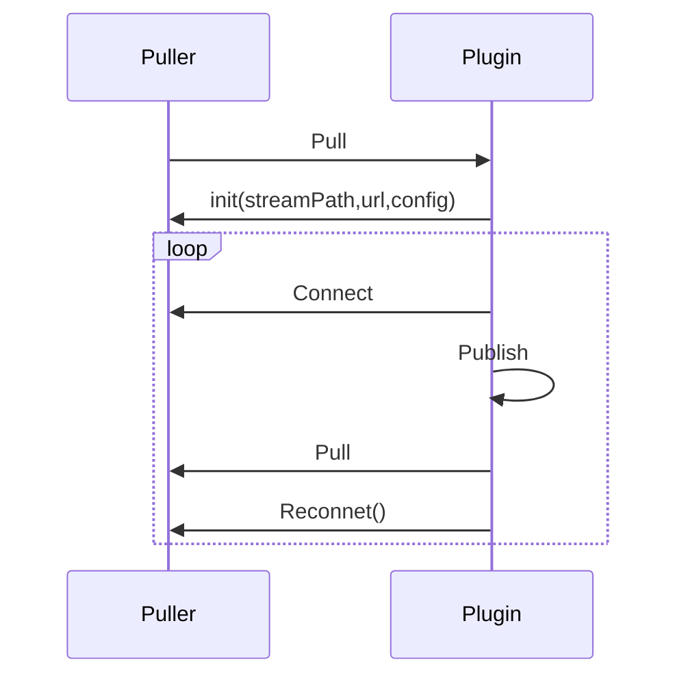

# Puller

Here, Puller refers to the function of pulling streams from remote servers.

:::tip
To master the usage of Puller, you can refer to the official plugins that make use of it, including rtmp, rtsp, hls, and hdl.
:::

## Sequence Diagram of Pulling Streams
  

## Customized Puller

Usually, Puller needs to publish the pulled stream to the engine, so it usually contains Publisher as well.

```go
import . "m7s.live/engine/v4"
type MyPuller struct {
  Publisher
  Puller
}
```

Including `Puller` does not automatically implement the `IPuller` interface, so you need to implement the `IPuller` interface yourself. You can freely add any properties you need to this struct.

## Implementing the IPuller interface
The first interface that needs to be implemented is the connection event callback, which needs to connect to the remote server.

```go
func (puller *MyPuller) Connect() (err error) {
  // Connect to the remote server
}
```
The second interface that needs to be implemented is the pull stream event callback, which needs to pull the stream.

```go
func (puller *MyPuller) Pull() error {
  // Pull the stream and put the data into the Track of Publisher
}
```
If the connection fails, the stream will not be published automatically, otherwise it will be published automatically, and then the `Pull` method will be called.

## Starting the Puller

Usually, plugins that include Puller provide automatic pull stream functions. You can see that the following method is called when the plugin is started.

In addition, there is also an on-demand pull stream function and a pull stream function after calling the API, and the calling method is the same.

```go
plugin.Pull(streamPath, url, new(MyPuller), 0)
```
If necessary, you can start to pull the stream programmatically as shown above.

## Reconnection after Disconnection

Reconnection after disconnection is supported by default, which means that when the remote connection is disconnected, `Connect` and `Pull` will be called again. It can be configured in the configuration file, such as the number of retries.