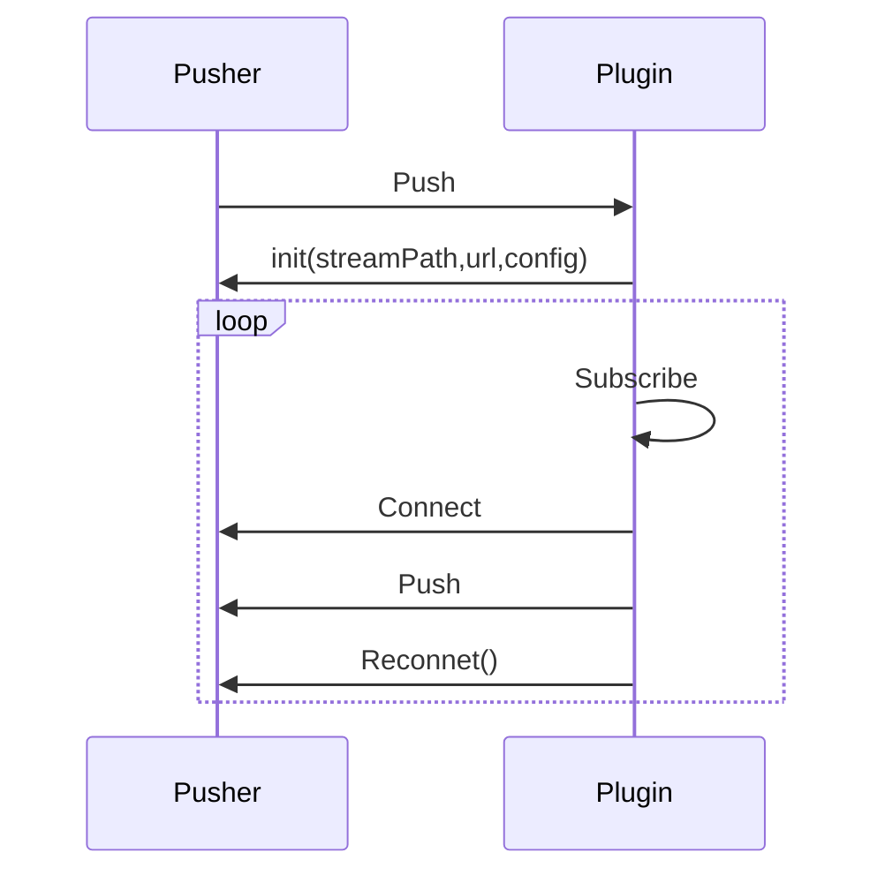

# Pusher

The pusher here refers to the function of pushing streams remotely.

:::tip
You can master the usage of the pusher by combining the use of Pusher in official plugins. Plugins that include the Pusher function are rtmp and rtsp.
:::

## Pusher Timing Diagram
  


## Custom Pusher

Usually, the pusher needs to subscribe to the flows in the engine and then push them out, so they usually also contain Subscriber.

```go
import . "m7s.live/engine/v4"
type MyPusher struct {
  Subscriber
  Pusher
}
```

After including `Pusher`, `IPusher` interface is not automatically implemented. Therefore, you need to implement the `IPusher` interface by yourself.
You can put your own required properties in this structure as you like.

## Implement IPusher interface
The first interface to be implemented is the connection event callback, where you need to connect to the remote server.

```go
func (Pusher *MyPusher) Connect() (err error) {
  // Connect to remote server
}
```
The second interface to be implemented is the push event callback, where you need to push the stream.

```go
func (Pusher *MyPusher) Push() error {
  // Push data to remote server
}
```
If the connection fails, it will not automatically subscribe to the stream. Otherwise, it will automatically subscribe to the stream and call the `Push` method.

## Start Pushing Streams

You can configure on-demand pushing and the function of pushing after calling the API, and the method of calling is the same.

```go
plugin.Push(streamPath, url, new(MyPusher), false)
```
If you need to push the stream under certain conditions, you can start pushing the stream by calling the API programmatically.

## Reconnect to the Server After Disconnection

By default, the reconnection function is supported. That is, when the remote connection is disconnected, `Connect` and `Push` will be called again. It can be configured after the configuration file is set.
