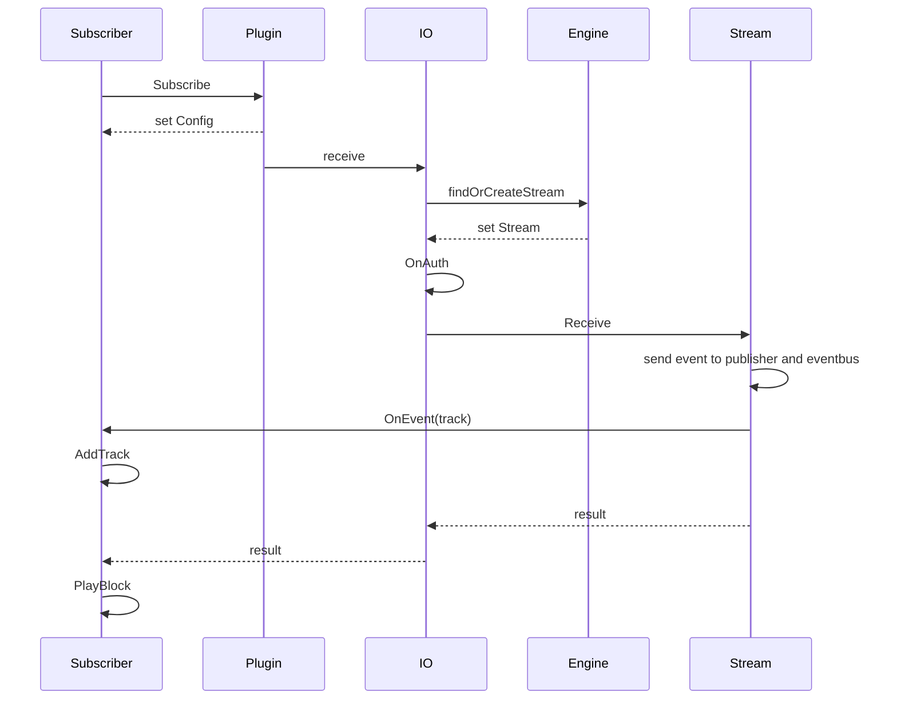

# Subscriber

The role of a subscriber is to extract audio, video or other data from the engine.

Once extracted, it is usually sent to a player or written to disk.

:::tip
To master the usage of Subscriber, we recommend to study the use of Subscriber in official plugins.
:::

## Sequence diagram of subscription



## Defining a Subscriber

Although `Subscriber` can be used directly as a subscriber, we usually need to customize a structure that contains `Subscriber`, which becomes a specific `Subscriber` with its own functions.

```go
import . "m7s.live/engine/v4"

type MySubscriber struct {
  Subscriber
}
```

By including `Subscriber`, the `ISubscriber` interface is automatically implemented.
In this structure, you can freely include the properties you need.

## Defining subscriber event callbacks

In v4, event callbacks replace all previous logic. The following are possible events:

```go
import (
  . "m7s.live/engine/v4"
  "m7s.live/engine/v4/track"
  "m7s.live/engine/v4/common"
)
func (p *MySubscriber) OnEvent(event any) {
  switch v:=event.(type) {
    case ISubscriber://Indicates a successful subscription event, and v is p
    case SEclose://Indicates a closed event
    case common.Track: //Indicates a Track event (including all Track events). If this is responded to, the following three types will be blocked
    case *track.Audio: //Indicates an AudioTrack event
    case *track.Video: //Indicates a VideoTrack event
    case *track.Data: //Indicates a DataTrack event
    case AudioDeConf: //Indicates an Audio sequence header event
    case VideoDeConf: //Indicates a Video sequence header event
    case common.ParamaterSets: //Indicates a VPS, SPS, PPS event for video
    case AudioFrame: //Indicates an AudioFrame event, which is received when using raw subscription
    case VideoFrame: //Indicates a VideoFrame event, which is received when using raw subscription
    case FLVFrame: //Indicates an event frame with FLV data, which is received when using flv subscription
    case VideoRTP: //Received a video RTP packet, which is received when using rtp subscription
    case AudioRTP: //Received an audio RTP packet, which is received when using rtp subscription
    default:
      p.Subscriber.OnEvent(event)
  }
}
```

If you receive `Track` or `*track.Audio`, `*track.Video`, `*track.Data`, you need to determine whether to receive the track and call `p.AddTrack(v)`.

Usually, if you want to receive everything, you can not respond to these types of events, and instead leave them to be handled by `Subscriber`'s `OnEvent` (i.e. enter from `default` above). The internal code is as follows:

```go
func (s *Subscriber) OnEvent(event any) {
    switch v := event.(type) {
    case Track: //Receive all tracks by default
        s.AddTrack(v)
    default:
        s.IO.OnEvent(event)
    }
}
```

## Starting the subscription

To read audio and video data, you need to register a subscription first.

### Register subscription (subscribe)

This function blocks for a short time until registration is successful or fails.

```go
sub := new(MySubscriber)
if plugin.Subscribe("live/test", sub) == nil {
  //Registration is successful
}
```

Once registration is successful, the subscription will be received in `OnEvent`.

### Start reading

You can read audio and video data using any of the following three methods, and different read methods will receive different events.

```go
func (s *Subscriber) PlayRaw() {
    s.PlayBlock(SUBTYPE_RAW)
}

func (s *Subscriber) PlayFLV() {
    s.PlayBlock(SUBTYPE_FLV)
}

func (s *Subscriber) PlayRTP() {
    s.PlayBlock(SUBTYPE_RTP)
}
```

If there is no other logic to separate processing, you can call the following method directly.

```go
func (opt *Plugin) SubscribeBlock(streamPath string, sub ISubscriber, t byte) (err error) {
	if err = opt.Subscribe(streamPath, sub); err == nil {
		sub.PlayBlock(t)
	}
	return
}
```

It reads data in a blocking manner.
Data received needs to be handled in `OnEvent`.
If the subscription is complete or interrupted, the blocking process will be released.

## Stop subscription

```go
sub.Stop()
```

## Resource follow-up closure

If a subscriber is strongly bound to a closeable resource (such as conn), you can call

```go
sub.SetIO(conn)
```

Then when the sub is closed, the `Close` method of `conn` will also be called.
Note: If the subscription is stopped actively (i.e. by calling `sub.Stop`), the `Close` method of `conn` will not be called.

## Adding a parent context to the subscriber

Sometimes we need the subscriber to follow a `Context` to be closed, you can call

```go
sub.SetParent(ctx)
```