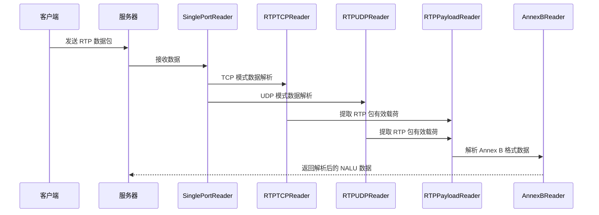

# 贯彻 Go 语言 Reader 接口设计哲学：以 Monibuca 中的流媒体处理为例

## 引言

Go 语言以其简洁、高效和并发安全的设计哲学而闻名，其中 io.Reader 接口是这一哲学的典型体现。在实际业务开发中，如何正确运用 io.Reader 接口的设计思想，对于构建高质量、可维护的系统至关重要。本文将以 Monibuca 流媒体服务器中的 RTP 数据处理为例，深入探讨如何在实际业务中贯彻 Go 语言的 Reader 接口设计哲学，包括同步编程模式、单一职责原则、关注点分离以及组合复用等核心概念。

## 什么是 Go 语言的 Reader 接口设计哲学？

Go 语言的 io.Reader 接口设计哲学主要体现在以下几个方面：

1. **简单性**：io.Reader 接口只定义了一个方法 `Read(p []byte) (n int, err error)`，这种极简设计使得任何实现了该方法的类型都可以被视为一个 Reader。

2. **组合性**：通过组合不同的 Reader，可以构建出功能强大的数据处理管道。

3. **单一职责**：每个 Reader 只负责一个特定的任务，符合单一职责原则。

4. **关注点分离**：不同的 Reader 负责处理不同的数据格式或协议，实现了关注点的分离。

## Monibuca 中的 Reader 设计实践

在 Monibuca 流媒体服务器中，我们设计了一系列的 Reader 来处理不同层次的数据：

1. **SinglePortReader**：处理单端口多路复用的数据流
2. **RTPTCPReader** 和 **RTPUDPReader**：分别处理 TCP 和 UDP 协议的 RTP 数据包
3. **RTPPayloadReader**：从 RTP 包中提取有效载荷
4. **AnnexBReader**：处理 H.264/H.265 的 Annex B 格式数据

> 备注：在处理 PS流时从RTPPayloadReader还要经过 PS包解析、PES包解析才进入 AnnexBReader

### 同步编程模式

Go 的 io.Reader 接口天然支持同步编程模式。在 Monibuca 中，我们通过同步方式逐层处理数据：

```go
// 从 RTP 包中读取数据
func (r *RTPPayloadReader) Read(buf []byte) (n int, err error) {
    // 如果缓冲区中有数据，先读取缓冲区中的数据
    if r.buffer.Length > 0 {
        n, _ = r.buffer.Read(buf)
        return n, nil
    }
    
    // 读取新的 RTP 包
    err = r.IRTPReader.Read(&r.Packet)
    // ... 处理数据
}
```

这种同步模式使得代码逻辑清晰，易于理解和调试。

### 单一职责原则

每个 Reader 都有明确的职责：

- **RTPTCPReader**：只负责从 TCP 流中解析 RTP 包
- **RTPUDPReader**：只负责从 UDP 数据包中解析 RTP 包
- **RTPPayloadReader**：只负责从 RTP 包中提取有效载荷
- **AnnexBReader**：只负责解析 Annex B 格式的数据

这种设计使得每个组件都非常专注，易于测试和维护。

### 关注点分离

通过将不同层次的处理逻辑分离到不同的 Reader 中，我们实现了关注点的分离：

```go
// 创建 RTP 读取器的示例
switch mode {
case StreamModeUDP:
    rtpReader = NewRTPPayloadReader(NewRTPUDPReader(conn))
case StreamModeTCPActive, StreamModeTCPPassive:
    rtpReader = NewRTPPayloadReader(NewRTPTCPReader(conn))
}
```

这种分离使得我们可以独立地修改和优化每一层的处理逻辑，而不会影响其他层。

### 组合复用

Go 语言的 Reader 设计哲学鼓励通过组合来复用代码。在 Monibuca 中，我们通过组合不同的 Reader 来构建完整的数据处理管道：

```go
// RTPPayloadReader 组合了 IRTPReader
type RTPPayloadReader struct {
    IRTPReader  // 组合接口
    // ... 其他字段
}

// AnnexBReader 可以与 RTPPayloadReader 组合使用
annexBReader := &AnnexBReader{}
rtpReader := NewRTPPayloadReader(NewRTPUDPReader(conn))
```

## 数据处理流程时序图

为了更直观地理解这些 Reader 是如何协同工作的，我们来看一个时序图：



## 实际应用中的设计模式

在 Monibuca 中，我们采用了多种设计模式来更好地贯彻 Reader 接口的设计哲学：

### 1. 装饰器模式

RTPPayloadReader 装饰了 IRTPReader，在读取 RTP 包的基础上增加了有效载荷提取功能。

### 2. 适配器模式

SinglePortReader 适配了多路复用的数据流，将其转换为标准的 io.Reader 接口。

### 3. 工厂模式

通过 `NewRTPTCPReader`、`NewRTPUDPReader` 等工厂函数来创建不同类型的 Reader。

## 性能优化与最佳实践

在实际应用中，我们还需要考虑性能优化：

1. **内存复用**：通过 `util.Buffer` 和 `util.Memory` 来减少内存分配
2. **缓冲机制**：在 RTPPayloadReader 中使用缓冲区来处理不完整的数据包
3. **错误处理**：通过 `errors.Join` 来合并多个错误信息

## 结论

通过在 Monibuca 流媒体服务器中的实践，我们可以看到 Go 语言的 Reader 接口设计哲学在实际业务中的强大威力。通过遵循同步编程模式、单一职责原则、关注点分离和组合复用等设计理念，我们能够构建出高内聚、低耦合、易于维护和扩展的系统。

这种设计哲学不仅适用于流媒体处理，也适用于任何需要处理数据流的场景。掌握并正确运用这些设计原则，将有助于我们编写出更加优雅和高效的 Go 代码。