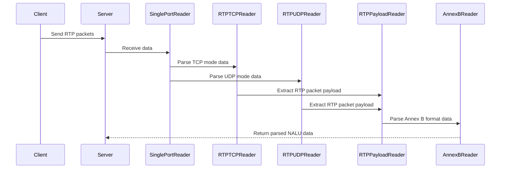

# Implementing Go's Reader Interface Design Philosophy: A Case Study with Monibuca Streaming Media Processing

## Introduction

Go is renowned for its philosophy of simplicity, efficiency, and concurrency safety, with the io.Reader interface being a prime example of this philosophy. In practical business development, correctly applying the design concepts of the io.Reader interface is crucial for building high-quality, maintainable systems. This article will explore how to implement Go's Reader interface design philosophy in real-world business scenarios using RTP data processing in the Monibuca streaming media server as an example, covering core concepts such as synchronous programming patterns, single responsibility principle, separation of concerns, and composition reuse.

## What is Go's Reader Interface Design Philosophy?

Go's io.Reader interface design philosophy is primarily reflected in the following aspects:

1. **Simplicity**: The io.Reader interface defines only one method `Read(p []byte) (n int, err error)`. This minimalist design means any type that implements this method can be considered a Reader.

2. **Composability**: By combining different Readers, powerful data processing pipelines can be built.

3. **Single Responsibility**: Each Reader is responsible for only one specific task, adhering to the single responsibility principle.

4. **Separation of Concerns**: Different Readers handle different data formats or protocols, achieving separation of concerns.

## Reader Design Practice in Monibuca

In the Monibuca streaming media server, we've designed a series of Readers to handle data at different layers:

1. **SinglePortReader**: Handles single-port multiplexed data streams
2. **RTPTCPReader** and **RTPUDPReader**: Handle RTP packets over TCP and UDP protocols respectively
3. **RTPPayloadReader**: Extracts payload from RTP packets
4. **AnnexBReader**: Processes H.264/H.265 Annex B format data

### Synchronous Programming Pattern

Go's io.Reader interface naturally supports synchronous programming patterns. In Monibuca, we process data layer by layer synchronously:

```go
// Reading data from RTP packets
func (r *RTPPayloadReader) Read(buf []byte) (n int, err error) {
    // If there's data in the buffer, read it first
    if r.buffer.Length > 0 {
        n, _ = r.buffer.Read(buf)
        return n, nil
    }
    
    // Read a new RTP packet
    err = r.IRTPReader.Read(&r.Packet)
    // ... process data
}
```

This synchronous pattern makes the code logic clear, easy to understand, and debug.

### Single Responsibility Principle

Each Reader has a clear responsibility:

- **RTPTCPReader**: Only responsible for parsing RTP packets from TCP streams
- **RTPUDPReader**: Only responsible for parsing RTP packets from UDP packets
- **RTPPayloadReader**: Only responsible for extracting payload from RTP packets
- **AnnexBReader**: Only responsible for parsing Annex B format data

This design makes each component very focused, making them easy to test and maintain.

### Separation of Concerns

By separating processing logic at different layers into different Readers, we achieve separation of concerns:

```go
// Example of creating an RTP reader
switch mode {
case StreamModeUDP:
    rtpReader = NewRTPPayloadReader(NewRTPUDPReader(conn))
case StreamModeTCPActive, StreamModeTCPPassive:
    rtpReader = NewRTPPayloadReader(NewRTPTCPReader(conn))
}
```

This separation allows us to modify and optimize the processing logic at each layer independently without affecting other layers.

### Composition Reuse

Go's Reader design philosophy encourages code reuse through composition. In Monibuca, we build complete data processing pipelines by combining different Readers:

```go
// RTPPayloadReader composes IRTPReader
type RTPPayloadReader struct {
    IRTPReader  // Composed interface
    // ... other fields
}

// AnnexBReader can be used in combination with RTPPayloadReader
annexBReader := &AnnexBReader{}
rtpReader := NewRTPPayloadReader(NewRTPUDPReader(conn))
```

## Data Processing Flow Sequence Diagram

To better understand how these Readers work together, let's look at a sequence diagram:



## Design Patterns in Practical Applications

In Monibuca, we've adopted several design patterns to better implement the Reader interface design philosophy:

### 1. Decorator Pattern

RTPPayloadReader decorates IRTPReader, adding payload extraction functionality on top of reading RTP packets.

### 2. Adapter Pattern

SinglePortReader adapts multiplexed data streams, converting them into the standard io.Reader interface.

### 3. Factory Pattern

Factory functions like `NewRTPTCPReader`, `NewRTPUDPReader`, etc., are used to create different types of Readers.

## Performance Optimization and Best Practices

In practical applications, we also need to consider performance optimization:

1. **Memory Reuse**: Using `util.Buffer` and `util.Memory` to reduce memory allocation
2. **Buffering Mechanism**: Using buffers in RTPPayloadReader to handle incomplete packets
3. **Error Handling**: Using `errors.Join` to combine multiple error messages

## Conclusion

Through our practice in the Monibuca streaming media server, we can see the powerful impact of Go's Reader interface design philosophy in real-world business scenarios. By following design concepts such as synchronous programming patterns, single responsibility principle, separation of concerns, and composition reuse, we can build highly cohesive, loosely coupled, maintainable, and extensible systems.

This design philosophy is not only applicable to streaming media processing but also to any scenario that requires data stream processing. Mastering and correctly applying these design principles will help us write more elegant and efficient Go code.