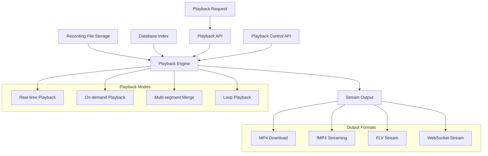
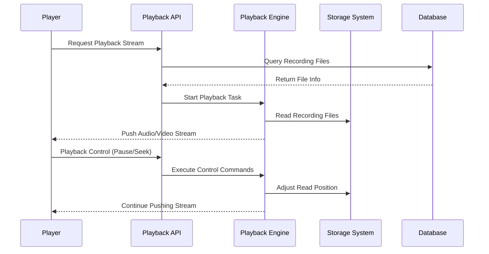
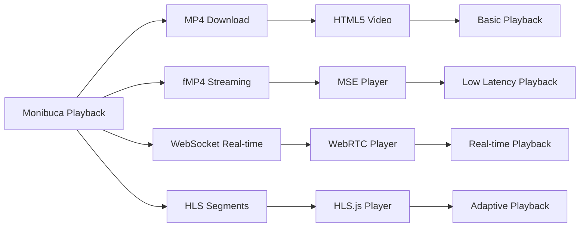
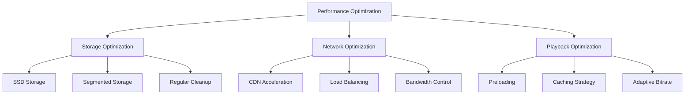
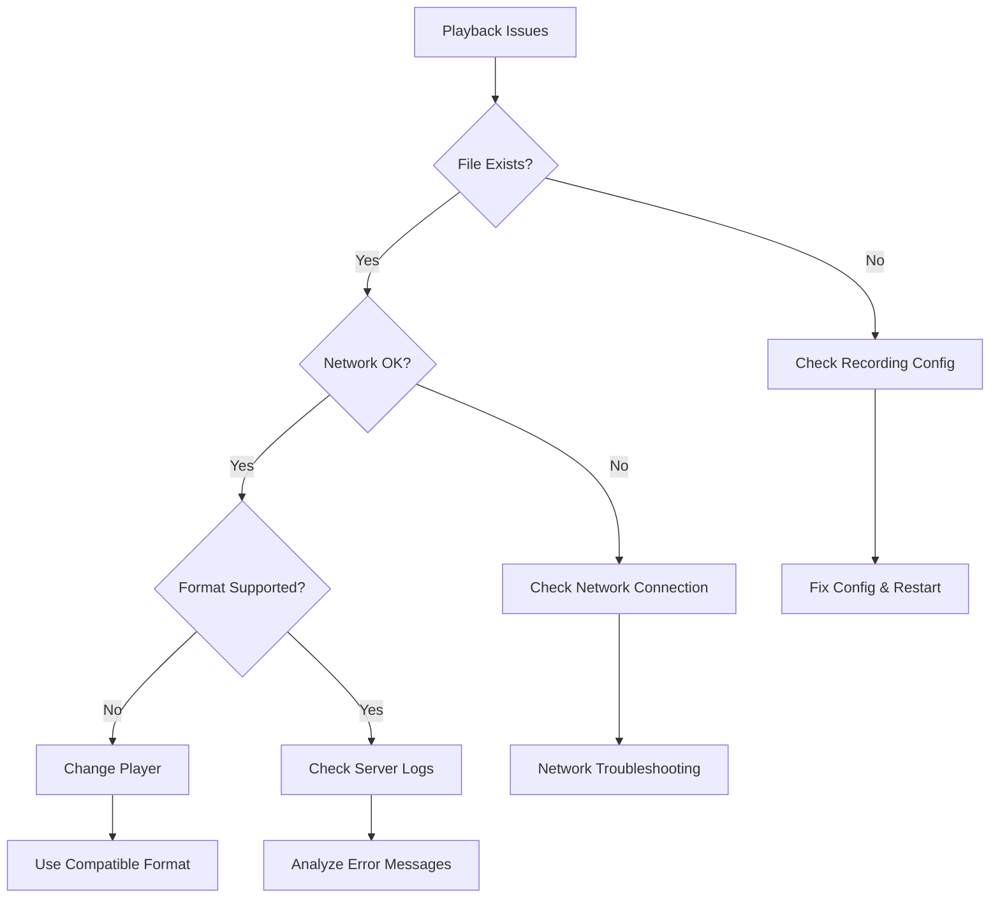

# Playback Feature

## Overview

The playback feature provides powerful playback capabilities for audio and video streams, supporting multiple output formats including MP4, FLV, and fragmented MP4 (fMP4). The system supports real-time playback, on-demand playback, multi-segment merged playback and other playback modes, providing flexible playback controls and rich player integration options.

## System Architecture



## Key Features

### Playback Modes
- **Real-time Playback**: Low-latency real-time stream playback
- **On-demand Playback**: Play content from specified time periods
- **Multi-segment Merge**: Automatically merge multiple recording segments
- **Loop Playback**: Continuous loop playback mode

### Format Support
- **MP4**: Standard container format, supports complete file download
- **fMP4**: Fragmented format, supports streaming and real-time playback
- **FLV**: Traditional format, good compatibility
- **WebSocket Stream**: Low-latency real-time transmission

### Playback Controls
- **Time Range Playback**: Precise time period playback
- **Seek and Speed Control**: Flexible playback controls
- **Pause and Resume**: Real-time playback control
- **Progress Adjustment**: Jump to any time point

### Advanced Features
- **Time Range Playback**: Precise time period playback
- **Multi-segment Auto Merge**: Seamlessly connect recording segments
- **Seek and Speed Control**: Flexible playback control
- **Loop Playback**: Continuous loop mode

## Playback Workflow


    participant API as Playback API
    participant Engine as Playback Engine
    participant Storage as Storage System
    participant DB as Database
    
    Player->>API: Request Playback Stream
    API->>DB: Query Recording Files
    DB-->>API: Return File Info
    API->>Engine: Start Playback Task
    Engine->>Storage: Read Recording File
    Engine-->>Player: Push Audio/Video Stream
    
    Player->>API: Playback Control (Pause/Seek)
    API->>Engine: Execute Control Command
    Engine->>Storage: Adjust Read Position
    Engine-->>Player: Continue Stream Push
```
## Configuration Examples

### Playback Pull Configuration

```yaml
mp4:
  onsub:
    pull:
      ^vod/(.+)$: live/$1  # vod/camera1 → live/camera1
  pull:
    live/movie: /path/to/movie.mp4
    delayclosetimeout: 3s
```

### Advanced Playback Configuration

```yaml
mp4:
  onsub:
    pull:
      # Basic playback matching
      ^vod/(.+)$: live/$1
      # Multi-level directory matching
      ^archive/(\d{4})/(\d{2})/(\d{2})/(.+)$: live/$4?start=$1-$2-$3T00:00:00
      # Independent playback progress
      ^vod(\d)/(.+)$: live/$2
```

**Key Parameter Description**:
- `delayclosetimeout`: Delay close time when no subscribers
- Regular expressions support capture groups, referenced with `$1`, `$2`
- Time parameters support ISO 8601 format and Unix timestamps

## Playback Management API

### Query API Endpoints

| Function | Method | Path | Description |
|----------|--------|------|-------------|
| Recording Files | GET | `/mp4/api/list/{streamPath}` | Get recording file list |
| Recording Catalog | GET | `/mp4/api/catalog` | Get recording directory structure |

### Stream Control API

| Function | Method | Path | Description |
|----------|--------|------|-------------|
| Pause Playback | POST | `/api/stream/pause/{streamPath}` | Pause stream playback |
| Resume Playback | POST | `/api/stream/resume/{streamPath}` | Resume stream playback |
| Set Speed | POST | `/api/stream/speed/{streamPath}` | Set playback speed |
| Time Seek | POST | `/api/stream/seek/{streamPath}` | Seek to specific time |

### API Usage Examples

```javascript
// Get recording list
const recordings = await fetch('/mp4/api/list/live/camera1').then(r => r.json());

// Get recording catalog
const catalog = await fetch('/mp4/api/catalog').then(r => r.json());

// Playback control
await fetch('/api/stream/pause/live/camera1', { method: 'POST' });
await fetch('/api/stream/speed/live/camera1', {
  method: 'POST',
  headers: { 'Content-Type': 'application/json' },
  body: JSON.stringify({ speed: 2.0 })
});

// Time seek
await fetch('/api/stream/seek/live/camera1', {
  method: 'POST',
  headers: { 'Content-Type': 'application/json' },
  body: JSON.stringify({ timeStamp: Math.floor(Date.now() / 1000) })
});
```

### Playback URL Formats

**Basic playback:**
`http://localhost:8080/flv/live/camera1.flv?start=2024-01-01T12:00:00`

**Time range playback:**
`http://localhost:8080/mp4/live/camera1.mp4?start=2024-01-01T12:00:00&end=2024-01-01T13:00:00`

**WebSocket real-time playback:**
`ws://localhost:8080/mp4/live/camera1.mp4`

## Frontend Player Integration

### Supported Playback Methods



### Common Player Integration

| Player Type | Use Case | Key Features |
|-------------|----------|--------------|
| HTML5 Video | Basic playback | Simple to use, good compatibility |
| Video.js | Professional playback | Feature-rich, many plugins |
| HLS.js | Streaming playback | Adaptive bitrate, low latency |
| Custom MSE | Real-time playback | Precise control, real-time performance |

### Basic Integration Example

```html
<!-- Basic MP4 playbook -->
<video controls>
  <source src="/mp4/download/live/camera1.mp4" type="video/mp4">
</video>

<!-- fMP4 streaming playbook -->
<video id="player"></video>
<script>
const video = document.getElementById('player');
const ws = new WebSocket('ws://localhost:8080/mp4/live/camera1.mp4');
// Use MSE for streaming playbook
</script>
```

## Performance Optimization Recommendations

### System Optimization



### Key Parameter Configuration

| Parameter | Recommended Value | Description |
|-----------|-------------------|-------------|
| fragment | 10-30s | Balance file size and performance |
| buffer_size | 10-30MB | Adjust based on network conditions |
| max_connections | 100-500 | Set based on server performance |
| cleanup_interval | 24h | Regular cleanup of expired files |

## Troubleshooting

### Common Problem Resolution Flow



### Monitoring Metrics

- **Playback Status**: Real-time monitoring of playback task status
- **File Reading**: Disk IO and read performance
- **Network Bandwidth**: Download bandwidth usage
- **Playback Quality**: Latency, frame drop rate, error rate
- **User Experience**: Buffer time, playback success rate

## Summary

Monibuca's playback feature provides a complete video playback solution, supporting multiple formats and playback methods. Through proper configuration and optimization, high-quality, low-latency audio and video playback services can be achieved. Key advantages include:

- **Flexible Playback Modes**: Support for real-time, on-demand, and multi-segment merged playback
- **Multi-format Support**: MP4, fMP4, FLV and other formats
- **Rich Playback Controls**: Pause, seek, speed control and other functions
- **Easy Integration**: Support for various mainstream players
- **High Performance**: Optimized storage reading and transmission mechanisms