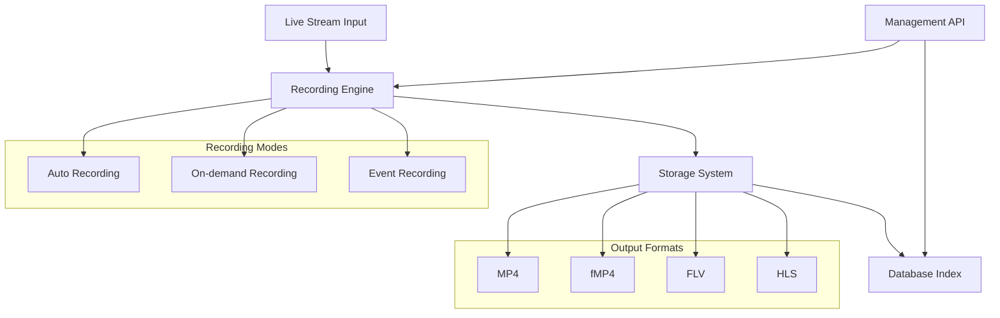
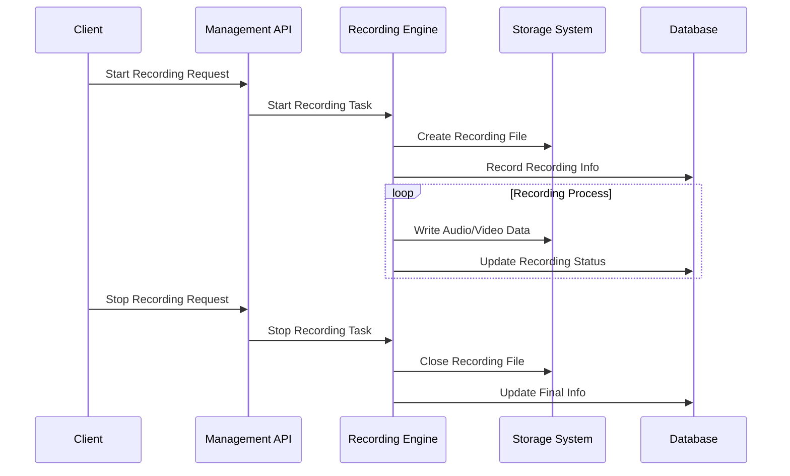
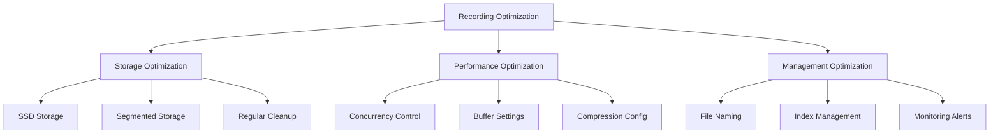
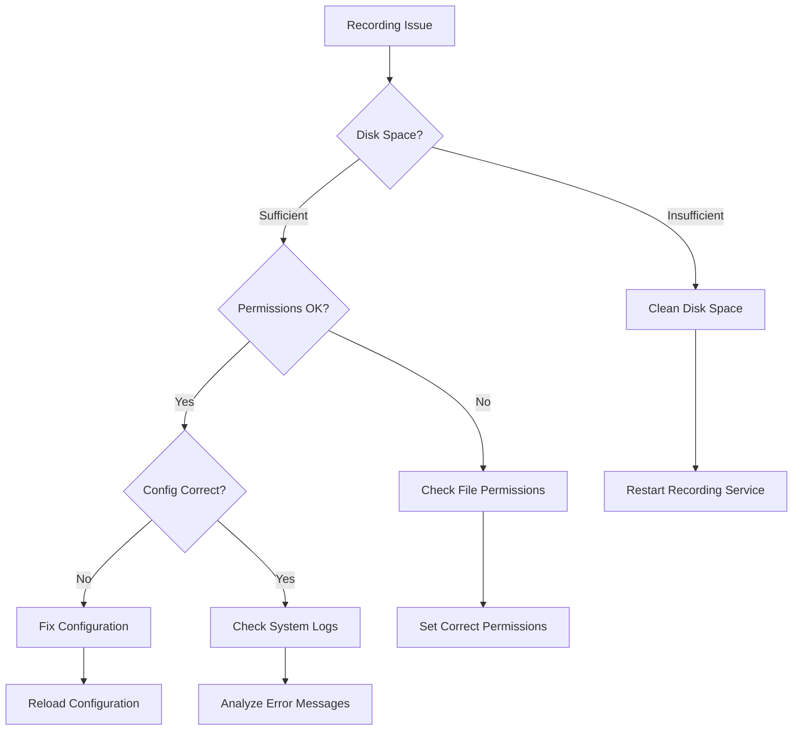

# Recording

## Overview

The recording feature provides comprehensive recording capabilities for live streams, supporting multiple output formats including MP4, FLV, and fragmented MP4 (fMP4). The system supports various recording modes such as automatic recording, on-demand recording, and event-triggered recording.

## System Architecture



## Key Features

### Recording Modes
- **Auto Recording**: Continuous recording based on configuration
- **On-demand Recording**: Start/stop recording via API calls
- **Event Recording**: Record specific time periods around events
- **Segment Recording**: Split recordings into time-based segments

### Format Support
- **MP4**: Standard container format, suitable for archiving and playback
- **fMP4**: Fragmented format supporting streaming writes
- **FLV**: Traditional format with good compatibility
- **HLS**: Segmented format suitable for distribution

### Advanced Features
- **Scheduled Recording**: Automatic recording based on time schedules
- **Size-based Segmentation**: Automatic splitting based on file size
- **Time-based Segmentation**: Automatic splitting based on duration
- **Auto Cleanup**: Periodic cleanup of expired recording files

## Recording Workflow



## Configuration Examples

### Recording Configuration

```yaml
mp4:
  onpub:
    record:
      ^live/(.+)$:  # Regular expression to match stream paths
        fragment: 10s
        filepath: record/$0  # Use capture group as filename
```

**Key Parameter Descriptions**:
- `fragment`: Segment duration, 0 means no segmentation
- `filepath`: Recording file path template
- Regular expressions support capture groups, referenced with `$0`, `$1`, `$2`

## Recording Management API

### Core API Endpoints

| Function | Method | Path | Description |
|----------|--------|------|-------------|
| Recording Files | GET | `/mp4/api/list/{streamPath}` | Get recording file list |
| Start Recording | POST | `/mp4/api/start/{streamPath}` | Start recording specified stream |
| Stop Recording | POST | `/mp4/api/stop/{streamPath}` | Stop recording specified stream |
| Delete Recording | POST | `/mp4/api/delete/{streamPath}` | Delete specified recording file |
| Event Recording | POST | `/mp4/api/event/start` | Start event recording |
| Recording Catalog | GET | `/mp4/api/catalog` | Get recording catalog information |

### API Usage Examples

```javascript
// Start recording
await fetch('/mp4/api/start/live/camera1', { method: 'POST' });

// Stop recording
await fetch('/mp4/api/stop/live/camera1', { method: 'POST' });

// Get recording file list
const recordings = await fetch('/mp4/api/list/live/camera1').then(r => r.json());

// Get recording catalog
const catalog = await fetch('/mp4/api/catalog').then(r => r.json());

// Delete recording files
await fetch('/mp4/api/delete/live/camera1', { 
  method: 'POST',
  headers: { 'Content-Type': 'application/json' },
  body: JSON.stringify({ ids: [1, 2, 3] })
});

// Event recording
await fetch('/mp4/api/event/start', {
  method: 'POST',
  headers: { 'Content-Type': 'application/json' },
  body: JSON.stringify({
    streamPath: 'live/camera1',
    eventId: 'alarm_001',
    eventName: 'Intrusion Detection',
    beforeDuration: '30s',
    afterDuration: '60s',
    eventDesc: 'Abnormal activity detected',
    eventLevel: '0'
  })
});
```

## Performance Optimization

### Storage Optimization



### Key Parameter Configuration

| Parameter | Recommended Value | Description |
|-----------|------------------|-------------|
| fragment | 10-30s | Balance file size and performance |
| buffer_size | 10-30MB | Adjust based on network conditions |
| max_files | 1000 | Maximum files per directory |
| cleanup_interval | 24h | Regular cleanup of expired files |

## Troubleshooting

### Common Issue Resolution Workflow



## Important Notes
1. Ensure sufficient storage space
2. Set reasonable segment duration
3. Ensure database functionality is enabled
4. Monitor disk usage
5. Regular cleanup of expired recording files
6. Check file permission settings
7. Set reasonable concurrent recording limits

## Monitoring Metrics

- **Recording Status**: Real-time monitoring of recording task status
- **Storage Space**: Disk usage rate and remaining space
- **File Quality**: Recording file integrity checks
- **Performance Metrics**: CPU, memory, IO usage

## Summary

Monibuca's recording feature provides a complete recording solution, supporting multiple formats and recording modes. Through proper configuration and optimization, high-quality, stable audio and video recording services can be achieved. Key advantages include:

- **Flexible Recording Modes**: Support for automatic, on-demand, and event-triggered recording
- **Multi-format Support**: MP4, fMP4, FLV, HLS and other formats
- **Comprehensive Management**: Rich API and monitoring capabilities
- **High Performance**: Optimized storage and writing mechanisms