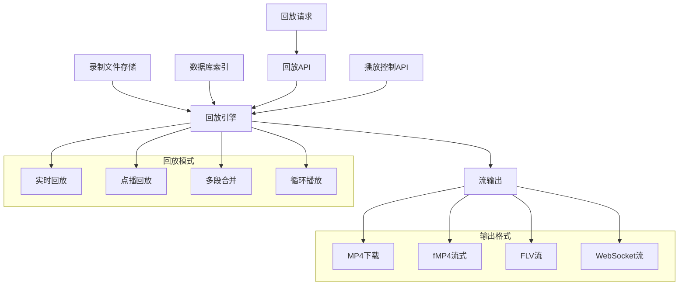
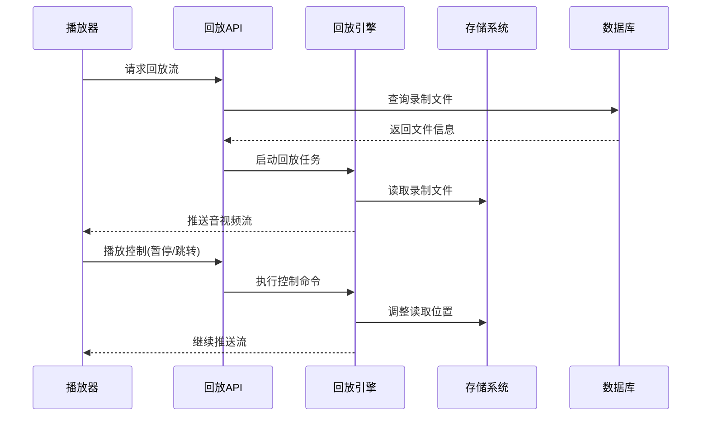
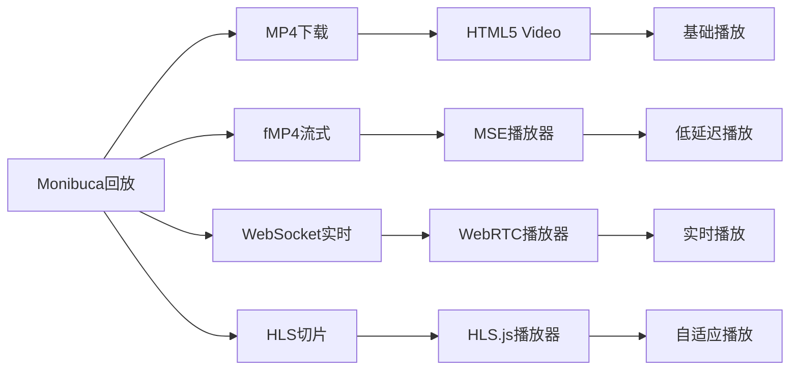
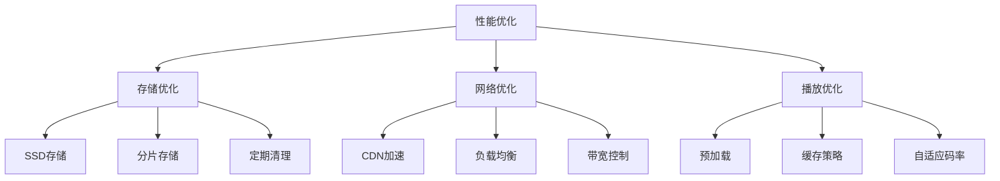
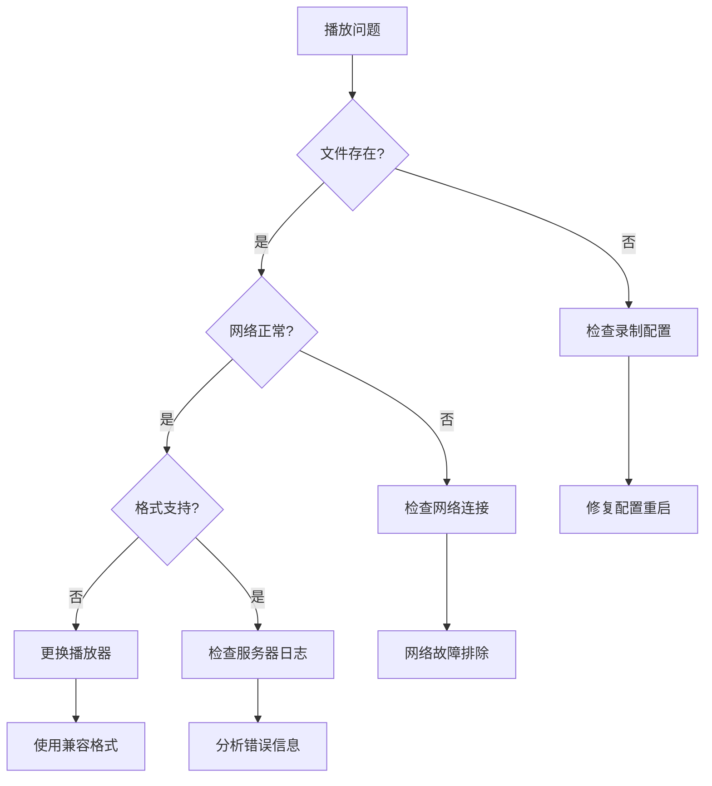

# 回放功能

## 概述

回放功能为音视频流提供强大的回放能力，支持多种输出格式，包括 MP4、FLV 和碎片化 MP4（fMP4）。该系统支持实时回放、点播回放、多段合并回放等多种回放模式，提供灵活的播放控制和丰富的播放器集成选项。

## 系统架构



## 主要特性

### 回放模式
- **实时回放**: 低延迟的实时流回放
- **点播回放**: 按需播放指定时间段内容
- **多段合并**: 自动合并多个录制片段
- **循环播放**: 连续循环播放模式

### 格式支持
- **MP4**: 标准容器格式，支持完整文件下载
- **fMP4**: 碎片化格式，支持流式传输和实时播放
- **FLV**: 传统格式，兼容性好
- **WebSocket流**: 低延迟实时传输

### 播放控制
- **时间范围回放**: 精确时间段播放
- **跳转和变速**: 灵活的播放控制
- **暂停恢复**: 实时播放控制
- **进度调整**: 任意时间点跳转

## 回放工作流程



## 配置示例

### 回放拉流配置

```yaml
mp4:
  onsub:
    pull:
      ^vod/(.+)$: live/$1  # vod/camera1 → live/camera1
  pull:
    live/movie: /path/to/movie.mp4
    delayclosetimeout: 3s
```

### 高级回放配置

```yaml
mp4:
  onsub:
    pull:
      # 基础回放匹配
      ^vod/(.+)$: live/$1
      # 多级目录匹配
      ^archive/(\d{4})/(\d{2})/(\d{2})/(.+)$: live/$4?start=$1-$2-$3T00:00:00
      # 独立回放进度
      ^vod(\d)/(.+)$: live/$2
```

**关键参数说明**:
- `delayclosetimeout`: 无订阅者时延迟关闭时间
- 正则表达式支持捕获组，用`$1`、`$2`引用
- 时间参数支持 ISO 8601 格式和 Unix 时间戳

## 回放管理API

### 查询API接口

| 功能 | 方法 | 路径 | 说明 |
|------|------|------|------|
| 录像列表 | GET | `/api/record/{type}/list/{streamPath}` | 获取录像文件列表 |
| 录像目录 | GET | `/api/record/{type}/catalog` | 获取录像目录结构 |

### 查询API接口

| 功能 | 方法 | 路径 | 说明 |
|------|------|------|------|
| 录像文件列表 | GET | `/mp4/api/list/{streamPath}` | 获取录像文件列表 |
| 录像目录 | GET | `/mp4/api/catalog` | 获取录像目录结构 |

### 流控制API

| 功能 | 方法 | 路径 | 说明 |
|------|------|------|------|
| 暂停播放 | POST | `/api/stream/pause/{streamPath}` | 暂停流播放 |
| 恢复播放 | POST | `/api/stream/resume/{streamPath}` | 恢复流播放 |
| 设置速度 | POST | `/api/stream/speed/{streamPath}` | 设置播放速度 |
| 时间跳转 | POST | `/api/stream/seek/{streamPath}` | 跳转到指定时间 |

### API使用示例

```javascript
// 获取录像列表
const recordings = await fetch('/mp4/api/list/live/camera1').then(r => r.json());

// 获取录像目录
const catalog = await fetch('/mp4/api/catalog').then(r => r.json());

// 播放控制
await fetch('/api/stream/pause/live/camera1', { method: 'POST' });
await fetch('/api/stream/speed/live/camera1', {
  method: 'POST',
  headers: { 'Content-Type': 'application/json' },
  body: JSON.stringify({ speed: 2.0 })
});

// 时间跳转
await fetch('/api/stream/seek/live/camera1', {
  method: 'POST',
  headers: { 'Content-Type': 'application/json' },
  body: JSON.stringify({ timeStamp: Math.floor(Date.now() / 1000) })
});
```

### 回放URL格式

**基础回放：**
`http://localhost:8080/flv/live/camera1.flv?start=2024-01-01T12:00:00`

**时间范围回放：**
`http://localhost:8080/mp4/live/camera1.mp4?start=2024-01-01T12:00:00&end=2024-01-01T13:00:00`

**WebSocket实时回放：**
`ws://localhost:8080/mp4/live/camera1.mp4`
## 前端播放器集成

### 支持的播放方式



### 常用播放器集成

| 播放器类型 | 适用场景 | 主要特点 |
|------------|----------|----------|
| HTML5 Video | 基础回放 | 简单易用，兼容性好 |
| Video.js | 专业回放 | 功能丰富，插件众多 |
| HLS.js | 流式回放 | 自适应码率，低延迟 |
| 自定义MSE | 实时回放 | 精确控制，实时性强 |

### 基础集成示例

```html
<!-- 基础MP4播放 -->
<video controls>
  <source src="/mp4/download/live/camera1.mp4" type="video/mp4">
</video>

<!-- fMP4流式播放 -->
<video id="player"></video>
<script>
const video = document.getElementById('player');
const ws = new WebSocket('ws://localhost:8080/mp4/live/camera1.mp4');
// 使用MSE实现流式播放
</script>
```

## 性能优化建议

### 系统优化



### 关键参数配置

| 参数 | 推荐值 | 说明 |
|------|--------|------|
| fragment | 10-30s | 平衡文件大小和性能 |
| buffer_size | 10-30MB | 根据网络条件调整 |
| max_connections | 100-500 | 根据服务器性能设置 |
| cleanup_interval | 24h | 定期清理过期文件 |

## 故障排除

### 常见问题解决流程



### 监控指标

- **回放状态**: 实时监控回放任务状态
- **文件读取**: 磁盘IO和读取性能
- **网络带宽**: 下载带宽使用情况
- **播放质量**: 延迟、丢帧率、错误率
- **用户体验**: 缓冲时间、播放成功率

## 总结

Monibuca回放功能提供了完整的视频回放解决方案，支持多种格式和播放方式。通过合理的配置和优化，可以实现高质量、低延迟的音视频回放服务。主要优势包括：

- **灵活的回放模式**: 支持实时、点播、多段合并回放
- **多格式支持**: MP4、fMP4、FLV等多种格式
- **丰富的播放控制**: 暂停、跳转、变速等功能
- **易于集成**: 支持各种主流播放器
- **高性能**: 优化的存储读取和传输机制
