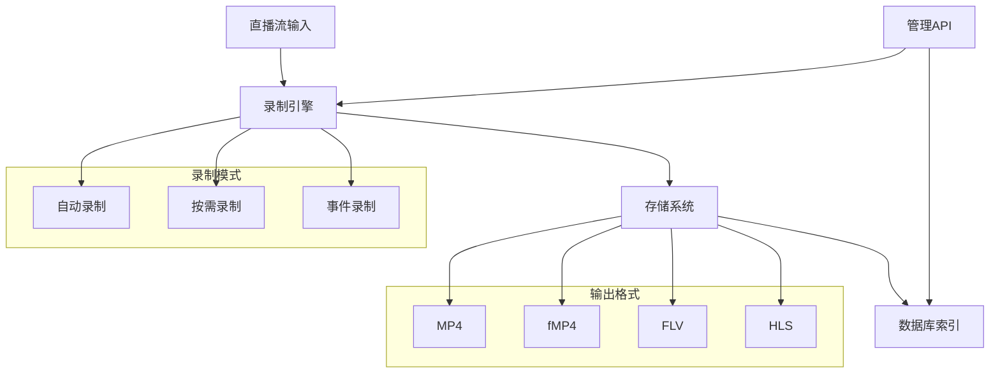
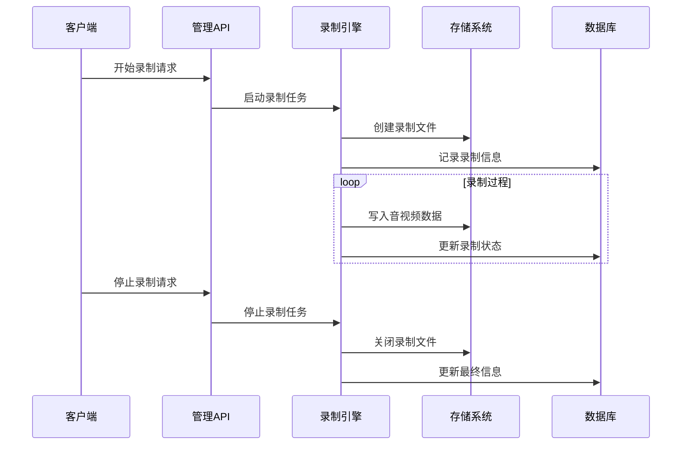
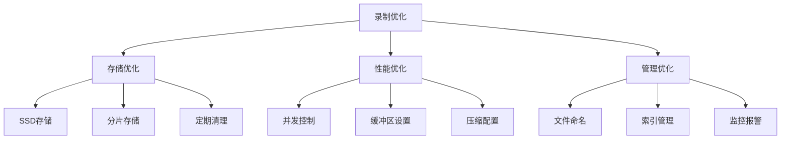
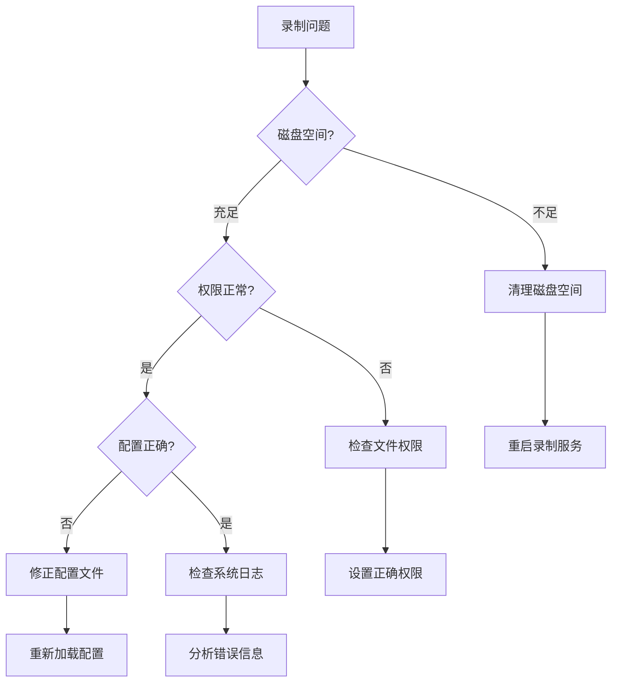

# 录制功能

## 概述

录制功能为直播流提供全面的录制能力，支持多种输出格式，包括 MP4、FLV 和碎片化 MP4（fMP4）。该系统支持自动录制、按需录制、事件触发录制等多种录制模式。

## 系统架构



## 主要特性

### 录制模式
- **自动录制**: 基于配置持续录制流
- **按需录制**: 通过 API 调用开始/停止录制  
- **事件录制**: 录制事件周围的特定时间段
- **分片录制**: 将录制分割为基于时间的片段

### 格式支持
- **MP4**: 标准容器格式，适合存档和回放
- **fMP4**: 碎片化格式，支持流式写入
- **FLV**: 传统格式，兼容性好
- **HLS**: 切片格式，适合分发

### 高级功能
- **定时录制**: 按时间计划自动录制
- **按大小分段**: 根据文件大小自动分割
- **按时间分段**: 根据时间长度自动分割
- **自动清理**: 定期清理过期录制文件

## 录制工作流程



## 配置示例

### 录制配置


```yaml
mp4:
  onpub:
    record:
      ^live/(.+)$:  # 正则表达式匹配流路径
        fragment: 10s
        filepath: record/$0  # 使用捕获组作为文件名
```

**关键参数说明**:
- `fragment`: 分片时长，0表示不分片
- `filepath`: 录制文件路径模板
- 正则表达式支持捕获组，用`$0`、`$1`、`$2`引用

## 录制管理API

### 核心API接口

| 功能 | 方法 | 路径 | 说明 |
|------|------|------|------|
| 录像列表 | GET | `/mp4/api/list/{streamPath}` | 获取录像文件列表 |
| 开始录制 | POST | `/mp4/api/start/{streamPath}` | 开始录制指定流 |
| 停止录制 | POST | `/mp4/api/stop/{streamPath}` | 停止录制指定流 |
| 删除录像 | POST | `/mp4/api/delete/{streamPath}` | 删除指定录像文件 |
| 事件录制 | POST | `/mp4/api/event/start` | 开始事件录制 |
| 录制目录 | GET | `/mp4/api/catalog` | 获取录制目录信息 |

### API使用示例

```javascript
// 开始录制
await fetch('/mp4/api/start/live/camera1', { method: 'POST' });

// 停止录制
await fetch('/mp4/api/stop/live/camera1', { method: 'POST' });

// 获取录像列表
const recordings = await fetch('/mp4/api/list/live/camera1').then(r => r.json());

// 获取录制目录
const catalog = await fetch('/mp4/api/catalog').then(r => r.json());

// 删除录像文件
await fetch('/mp4/api/delete/live/camera1', { 
  method: 'POST',
  headers: { 'Content-Type': 'application/json' },
  body: JSON.stringify({ ids: [1, 2, 3] })
});

// 事件录制
await fetch('/mp4/api/event/start', {
  method: 'POST',
  headers: { 'Content-Type': 'application/json' },
  body: JSON.stringify({
    streamPath: 'live/camera1',
    eventId: 'alarm_001',
    eventName: '入侵检测',
    beforeDuration: '30s',
    afterDuration: '60s',
    eventDesc: '检测到异常活动',
    eventLevel: '0'
  })
});
```

## 性能优化建议

### 存储优化



### 关键参数配置

| 参数 | 推荐值 | 说明 |
|------|--------|------|
| fragment | 10-30s | 平衡文件大小和性能 |
| buffer_size | 10-30MB | 根据网络条件调整 |
| max_files | 1000 | 单目录最大文件数 |
| cleanup_interval | 24h | 定期清理过期文件 |

## 故障排除

### 常见问题解决流程



## 注意事项
1. 确保存储空间充足
2. 合理设置分段时长
3. 确保数据库功能正常开启
4. 监控磁盘使用情况
5. 定期清理过期录制文件
6. 检查文件权限设置
7. 设置合理的并发录制数量

## 监控指标

- **录制状态**: 实时监控录制任务状态
- **存储空间**: 磁盘使用率和剩余空间
- **文件质量**: 录制文件完整性检查
- **性能指标**: CPU、内存、IO使用情况

## 总结

Monibuca录制功能提供了完整的录制解决方案，支持多种格式和录制模式。通过合理的配置和优化，可以实现高质量、稳定的音视频录制服务。主要优势包括：

- **灵活的录制模式**: 支持自动、按需、事件触发录制
- **多格式支持**: MP4、fMP4、FLV、HLS等多种格式
- **完善的管理**: 丰富的API和监控功能
- **高性能**: 优化的存储和写入机制