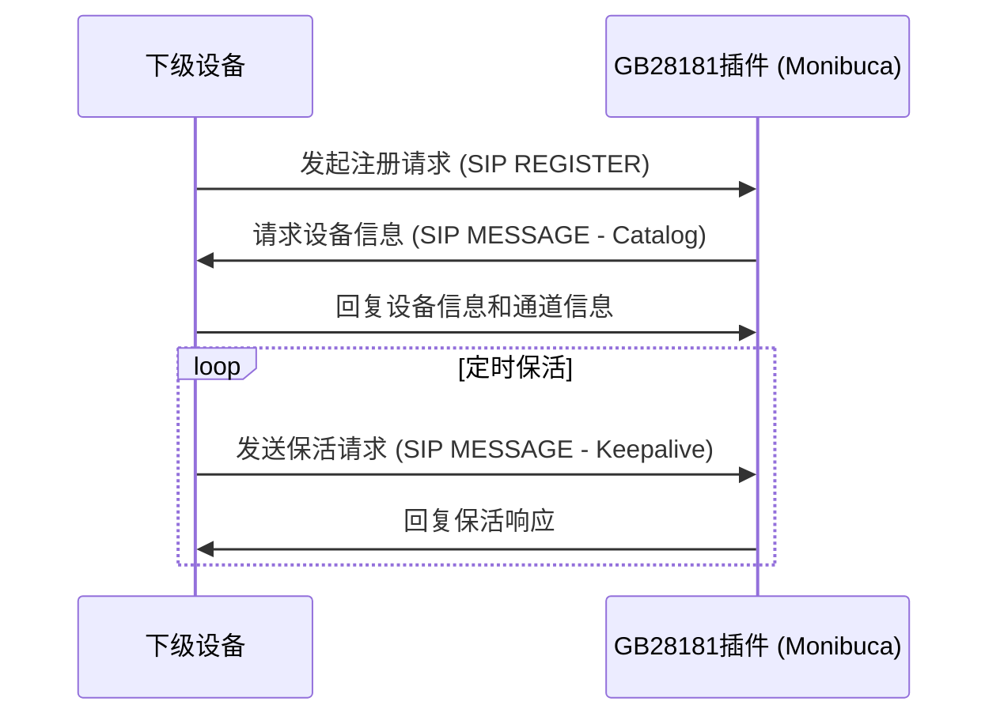
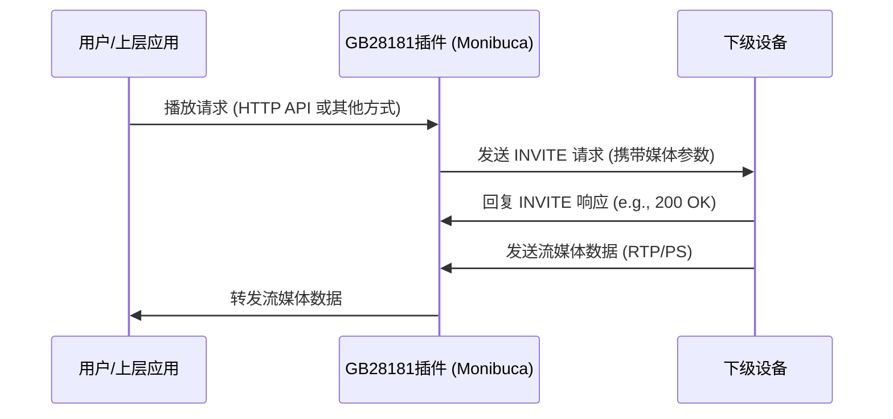
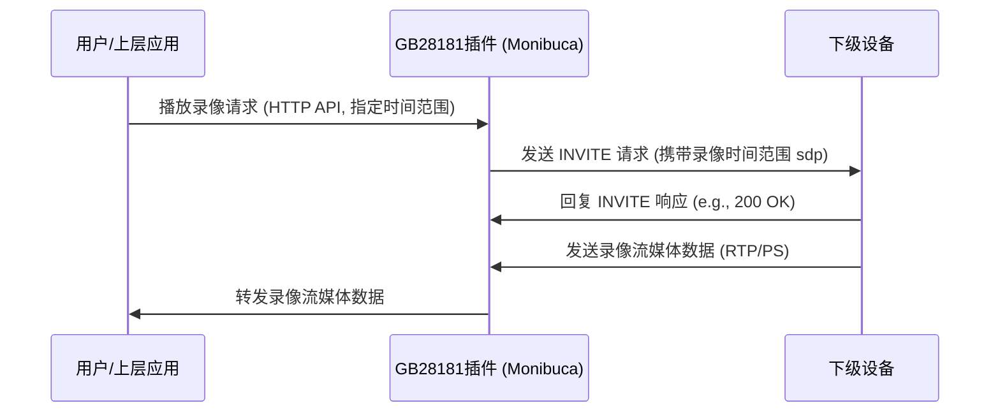
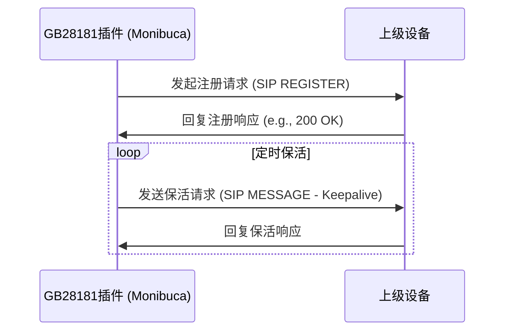
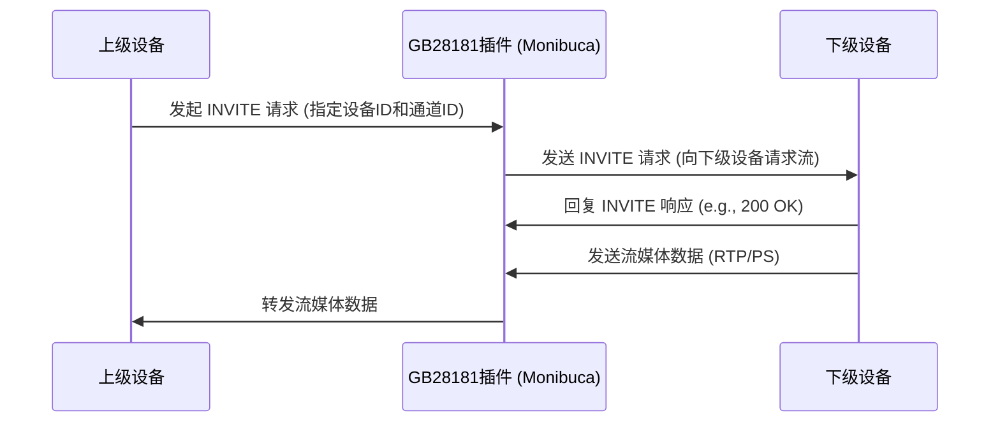
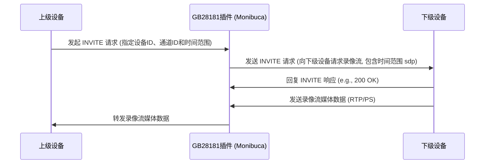

# GB28181协议
GB28181协议（全称：GB/T 28181《公共安全视频监控联网系统信息传输、交换、控制技术要求》）是中国公共安全领域的国家标准，旨在规范视频监控设备间的互联互通，实现统一管理和数据安全传输。本文档描述了 Monibuca (m7s) 流媒体服务器中 GB28181 协议的实现，重点介绍协议的架构、连接处理和媒体流传输功能。

## 架构概述
Monibuca 中的 GB28181 被构建为一个插件，支持下级 GB28181 设备注册到 Monibuca (m7s),并在 Monibuca (m7s) 内部进行多协议的直播和录像点播,能通过 http 接口对下级设备进行云台控制,录像控制,播放控制,预置位设置,订阅报警、目录、移动位置,同时支持级联上级设备,供上级设备播放、录像点播放等功能。该插件默认在 554 端口注册标准 GB28181 服务，收流端口默认范围是10001-20000,并可以配置使用自定义端口。

### 核心组件

| 组件      |描述 |
|----------|:----|
| GB28181Plugin | 主插件结构，包含配置和初始化逻辑   |
| Device     | 下级设备   |
| Channel    | 设备下的通道 |
| Platform   | 上级设备    |

## GB28181协议流程

### 与下级设备

#### 注册相关

1. 下级设备向 GB28181 插件发起注册请求
2. GB28181 插件向下级设备获取设备信息及通道信息
3. 下级设备向 GB28181 插件定时发送保活请求



#### 播放直播

1. 从播放请求里获取目标设备ID和通道ID
2. 向目标设备发送invite请求
3. 下级设备通过invite请求内的参数向 GB28181 插件发送流媒体数据



#### 播放录像

1. 从播放请求里获取目标设备ID和通道ID及录像的开始时间和结束时间
2. 向目标设备发送invite请求,invite请求里设置录像的开始时间和结束时间
3. 下级设备通过invite请求内的参数向 GB28181 插件发送流媒体数据



### 与上级设备

#### 注册相关

1. 通过接口添加上级设备的连接信息
2. GB28181 插件向上级设备发起注册
3. 注册成功后定时发送请求保活



#### 播放直播

1. 上级设备向 GB28181 插件发起invite请求
2. GB28181插件 从invite请求中解析出下级设备的设备ID和通道ID
3. 向下级目标设备发送invite请求
4. 得到正确回应后,接收下级设备的流媒体数据并转发至上级设备



#### 播放录像

1. 上级设备向 GB28181 插件发起invite请求
2. GB28181插件 从invite请求中解析出下级设备的设备ID和通道ID以及录像的开始时间和结束时间
3. 向下级目标设备发送invite请求,invite请求里设置录像的开始时间和结束时间
4. 得到正确回应后,接收下级设备的流媒体数据并转发至上级设备



## 配置和初始化

```yaml
gb28181:
  mediaip: 192.168.1.52  #流媒体收流IP,必填
  sipip: 192.168.1.52  #SIP通讯IP,必填
  mediaport: "10001-20000"   #默认收流端口范围,可选
  serial: "34020000002000000001"   #服务器serverid,可选
  realm: "3402000000"    #服务器域,可选
  password: "123456"     #设备验证密码,可选
  sip:
    listenaddr:
          - udp::5060    #SIP通讯端口,必填
  onsub:
    pull:
      ^gb_\d+/(.+)$: $1    #播放GB设备请求URL的正则,例如deviceid,channelid分别为34020000001110000003,34020000001320000003,则在系统内的地址为http://localhost:8080/flv/gb_1/34020000001110000003/34020000001320000003.flv,其他协议类同
```


## API接口说明

GB28181插件的API通过gRPC提供，并映射到HTTP接口。以下是主要的API端点及其功能，均基于 `gb28181.proto` 定义：

### 设备管理 (Device Management)

- **`GET /gb28181/api/list`**
    - 描述: 获取设备列表 (同 `GetDevices`)。
    - RPC: `List(GetDevicesRequest) returns (DevicesPageInfo)`
    - 请求参数: `GetDevicesRequest`
        - `page` (int32, 可选): 页码。
        - `count` (int32, 可选): 每页数量。
        - `query` (string, 可选): 查询关键字 (设备ID或名称)。
        - `status` (bool, 可选): 设备在线状态。
    - 响应: `DevicesPageInfo`

- **`GET /gb28181/api/devices/{deviceId}`**
    - 描述: 使用ID查询国标设备信息。
    - RPC: `GetDevice(GetDeviceRequest) returns (DeviceResponse)`
    - URL参数:
        - `deviceId` (string, 必选): 设备ID。
    - 响应: `DeviceResponse`

- **`GET /gb28181/api/devices`**
    - 描述: 分页查询国标设备。
    - RPC: `GetDevices(GetDevicesRequest) returns (DevicesPageInfo)`
    - 请求参数: `GetDevicesRequest` (同上 `List`)
    - 响应: `DevicesPageInfo`

- **`DELETE /gb28181/api/devices/{deviceId}/delete`**
    - 描述: 移除设备。
    - RPC: `DeleteDevice(DeleteDeviceRequest) returns (DeleteDeviceResponse)`
    - URL参数:
        - `deviceId` (string, 必选): 设备ID。
    - 响应: `DeleteDeviceResponse`

- **`POST /gb28181/api/device/add`**
    - 描述: 添加设备信息。
    - RPC: `AddDevice(Device) returns (BaseResponse)`
    - 请求体: `Device` message
    - 响应: `BaseResponse`

- **`POST /gb28181/api/device/update`**
    - 描述: 更新设备信息。
    - RPC: `UpdateDevice(Device) returns (BaseResponse)`
    - 请求体: `Device` message
    - 响应: `BaseResponse`

- **`GET /gb28181/api/devices/{deviceId}/status`**
    - 描述: 设备状态查询。
    - RPC: `GetDeviceStatus(GetDeviceStatusRequest) returns (DeviceStatusResponse)`
    - URL参数:
        - `deviceId` (string, 必选): 设备ID。
    - 响应: `DeviceStatusResponse`

### 通道管理 (Channel Management)

- **`GET /gb28181/api/devices/{deviceId}/channels`**
    - 描述: 分页查询指定设备的通道。
    - RPC: `GetChannels(GetChannelsRequest) returns (ChannelsPageInfo)`
    - URL参数:
        - `deviceId` (string, 必选): 设备ID。
    - 请求参数: `GetChannelsRequest`
        - `page` (int32, 可选): 页码。
        - `count` (int32, 可选): 每页数量。
        - `query` (string, 可选): 查询关键字 (通道ID或名称)。
        - `online` (bool, 可选): 通道在线状态。
        - `channelType` (bool, 可选): 是否为设备通道。
    - 响应: `ChannelsPageInfo`

- **`GET /gb28181/api/devices/{deviceId}/sync`**
    - 描述: 同步设备通道信息。
    - RPC: `SyncDevice(SyncDeviceRequest) returns (SyncStatus)`
    - URL参数:
        - `deviceId` (string, 必选): 设备ID。
    - 响应: `SyncStatus`

- **`GET /gb28181/api/sub_channels/{deviceId}/{channelId}/channels`**
    - 描述: 分页查询子目录通道。
    - RPC: `GetSubChannels(GetSubChannelsRequest) returns (ChannelsPageInfo)`
    - URL参数:
        - `deviceId` (string, 必选): 设备ID。
        - `channelId` (string, 必选): 父通道ID。
    - 响应: `ChannelsPageInfo`

- **`POST /gb28181/api/channel/audio`**
    - 描述: 开启/关闭通道的音频。
    - RPC: `ChangeAudio(ChangeAudioRequest) returns (BaseResponse)`
    - 请求体: `ChangeAudioRequest`
    - 响应: `BaseResponse`

- **`POST /gb28181/api/channel/stream/identification/update`**
    - 描述: 修改通道的码流类型。
    - RPC: `UpdateChannelStreamIdentification(Channel) returns (BaseResponse)`
    - 请求体: `Channel` message
    - 响应: `BaseResponse`

- **`GET /gb28181/api/channel/raw`**
    - 描述: 国标通道编辑时的数据回显。
    - RPC: `GetRawChannel(GetRawChannelRequest) returns (Channel)`
    - 请求参数: `GetRawChannelRequest`
    - 响应: `Channel`

### 播放与录像 (Playback and Recording)

- **`GET /gb28181/api/records/{deviceId}/{channelId}`**
    - 描述: 查询录像记录。
    - RPC: `QueryRecord(QueryRecordRequest) returns (QueryRecordResponse)`
    - URL参数:
        - `deviceId` (string, 必选): 设备ID。
        - `channelId` (string, 必选): 通道ID。
    - 请求参数: `QueryRecordRequest` (包含开始/结束时间等)
    - 响应: `QueryRecordResponse`

- **`GET /gb28181/api/recording/{cmdType}/{deviceId}/{channelId}`**
    - 描述: 录制控制 (开始/停止)。
    - RPC: `Recording(RecordingRequest) returns (BaseResponse)`
    - URL参数:
        - `cmdType` (string, 必选): 命令类型 ("start" 或 "stop")。
        - `deviceId` (string, 必选): 设备ID。
        - `channelId` (string, 必选): 通道ID。
    - 响应: `BaseResponse`

- **`GET /gb28181/api/playback/pause`**
    - 描述: 回放暂停。
    - RPC: `PlaybackPause(PlaybackPauseRequest) returns (BaseResponse)`
    - 请求参数: `PlaybackPauseRequest`
    - 响应: `BaseResponse`

- **`GET /gb28181/api/playback/resume`**
    - 描述: 回放恢复。
    - RPC: `PlaybackResume(PlaybackResumeRequest) returns (BaseResponse)`
    - 请求参数: `PlaybackResumeRequest`
    - 响应: `BaseResponse`

- **`GET /gb28181/api/playback/seek`**
    - 描述: 回放拖动播放。
    - RPC: `PlaybackSeek(PlaybackSeekRequest) returns (BaseResponse)`
    - 请求参数: `PlaybackSeekRequest` (包含目标时间)
    - 响应: `BaseResponse`

- **`GET /gb28181/api/playback/speed`**
    - 描述: 回放倍速播放。
    - RPC: `PlaybackSpeed(PlaybackSpeedRequest) returns (BaseResponse)`
    - 请求参数: `PlaybackSpeedRequest` (包含播放速度)
    - 响应: `BaseResponse`

### 云台控制 (PTZ Control)

- **`GET /gb28181/api/ptz/{deviceId}/{channelId}`**
    - 描述: PTZ 云台控制。
    - RPC: `PtzControl(PtzControlRequest) returns (BaseResponse)`
    - URL参数:
        - `deviceId` (string, 必选): 设备ID。
        - `channelId` (string, 必选): 通道ID。
    - 请求参数: `PtzControlRequest` (包含PTZ命令，如 "UP", "DOWN", "ZOOM_IN" 等)
    - 响应: `BaseResponse`

- **`GET /gb28181/api/fi/iris/{deviceId}/{channelId}`**
    - 描述: 光圈控制。
    - RPC: `IrisControl(IrisControlRequest) returns (BaseResponse)`
    - URL参数 & 请求参数: 类似于PTZ控制。
    - 响应: `BaseResponse`

- **`GET /gb28181/api/fi/focus/{deviceId}/{channelId}`**
    - 描述: 聚焦控制。
    - RPC: `FocusControl(FocusControlRequest) returns (BaseResponse)`
    - URL参数 & 请求参数: 类似于PTZ控制。
    - 响应: `BaseResponse`

- **`GET /gb28181/api/preset/query/{deviceId}/{channelId}`**
    - 描述: 查询预置位。
    - RPC: `QueryPreset(PresetRequest) returns (PresetResponse)`
    - URL参数 & 请求参数: 类似于PTZ控制。
    - 响应: `PresetResponse`

- **`GET /gb28181/api/preset/{deviceId}/{channelId}`**
    - 描述: 设置预置位。
    - RPC: `AddPreset(PresetRequest) returns (BaseResponse)`
    - URL参数 & 请求参数: 类似于PTZ控制。
    - 响应: `BaseResponse`

- **`GET /gb28181/api/preset/call/{deviceId}/{channelId}`**
    - 描述: 调用预置位。
    - RPC: `CallPreset(PresetRequest) returns (BaseResponse)`
    - URL参数 & 请求参数: 类似于PTZ控制。
    - 响应: `BaseResponse`

- **`GET /gb28181/api/preset/delete/{deviceId}/{channelId}`**
    - 描述: 删除预置位。
    - RPC: `DeletePreset(PresetRequest) returns (BaseResponse)`
    - URL参数 & 请求参数: 类似于PTZ控制。
    - 响应: `BaseResponse`

- **其他PTZ相关控制**: 巡航 (Cruise), 扫描 (Scan), 雨刷 (Wiper), 辅助开关 (Auxiliary) 等，其API格式与上述类似，具体请参照 `gb28181.proto`。

### 平台管理 (Platform Management)

- **`POST /gb28181/api/platform/add`**
    - 描述: 添加平台信息。
    - RPC: `AddPlatform(Platform) returns (BaseResponse)`
    - 请求体: `Platform` message
    - 响应: `BaseResponse`

- **`GET /gb28181/api/platform/{id}`**
    - 描述: 获取平台信息。
    - RPC: `GetPlatform(GetPlatformRequest) returns (PlatformResponse)`
    - URL参数:
        - `id` (string, 必选): 平台ID。
    - 响应: `PlatformResponse`

- **`POST /gb28181/api/platform/update`**
    - 描述: 更新平台信息。
    - RPC: `UpdatePlatform(Platform) returns (BaseResponse)`
    - 请求体: `Platform` message
    - 响应: `BaseResponse`

- **`POST /gb28181/api/platform/{id}`**
    - 描述: 删除平台信息。
    - RPC: `DeletePlatform(DeletePlatformRequest) returns (BaseResponse)`
    - URL参数:
        - `id` (string, 必选): 平台ID。
    - 响应: `BaseResponse`

- **`GET /gb28181/api/platform/list`**
    - 描述: 获取平台列表。
    - RPC: `ListPlatforms(ListPlatformsRequest) returns (PlatformsPageInfo)`
    - 请求参数: `ListPlatformsRequest` (可包含分页等)
    - 响应: `PlatformsPageInfo`

- **`POST /gb28181/api/platform/channel/add`**
    - 描述: 添加平台通道。
    - RPC: `AddPlatformChannel(AddPlatformChannelRequest) returns (BaseResponse)`
    - 请求体: `AddPlatformChannelRequest`
    - 响应: `BaseResponse`

### 其他功能 (Other Functions)

- **`POST /gb28181/api/transport/{deviceId}/{streamMode}`**
    - 描述: 修改数据流传输模式 (TCP/UDP)。
    - RPC: `UpdateTransport(UpdateTransportRequest) returns (BaseResponse)`
    - URL参数:
        - `deviceId` (string, 必选): 设备ID。
        - `streamMode` (string, 必选): 流模式 ("TCP" 或 "UDP")。
    - 响应: `BaseResponse`

- **`GET /gb28181/api/alarm/{deviceId}`**
    - 描述: 设备报警查询。
    - RPC: `GetDeviceAlarm(GetDeviceAlarmRequest) returns (DeviceAlarmResponse)`
    - URL参数:
        - `deviceId` (string, 必选): 设备ID。
    - 请求参数: `GetDeviceAlarmRequest` (可包含时间范围、报警级别等)
    - 响应: `DeviceAlarmResponse`

- **`GET /gb28181/api/{deviceId}/sync_status`**
    - 描述: 获取通道同步进度。
    - RPC: `GetSyncStatus(GetSyncStatusRequest) returns (SyncStatus)`
    - URL参数:
        - `deviceId` (string, 必选): 设备ID。
    - 响应: `SyncStatus`

- **`GET /gb28181/api/{deviceId}/subscribe_info`**
    - 描述: 获取设备的订阅状态。
    - RPC: `GetSubscribeInfo(GetSubscribeInfoRequest) returns (SubscribeInfoResponse)`
    - URL参数:
        - `deviceId` (string, 必选): 设备ID。
    - 响应: `SubscribeInfoResponse`

- **`GET /gb28181/api/snap/{deviceId}/{channelId}`**
    - 描述: 请求截图。
    - RPC: `GetSnap(GetSnapRequest) returns (SnapResponse)`
    - URL参数:
        - `deviceId` (string, 必选): 设备ID。
        - `channelId` (string, 必选): 通道ID。
    - 响应: `SnapResponse` (通常包含图片URL或数据)

- **`POST /gb28181/api/play/convertStop/{key}`**
    - 描述: 结束转码。
    - RPC: `StopConvert(ConvertStopRequest) returns (BaseResponse)`
    - URL参数:
        - `key` (string, 必选): 转码任务的标识。
    - 响应: `BaseResponse`

- **`POST /gb28181/api/play/broadcast/{deviceId}/{channelId}`**
    - 描述: 语音广播命令。
    - RPC: `StartBroadcast(BroadcastRequest) returns (BroadcastResponse)`
    - URL参数:
        - `deviceId` (string, 必选): 设备ID。
        - `channelId` (string, 必选): 通道ID。
    - 响应: `BroadcastResponse`

- **`POST /gb28181/api/play/broadcast/stop/{deviceId}/{channelId}`**
    - 描述: 停止语音广播。
    - RPC: `StopBroadcast(BroadcastRequest) returns (BaseResponse)`
    - URL参数:
        - `deviceId` (string, 必选): 设备ID。
        - `channelId` (string, 必选): 通道ID。
    - 响应: `BaseResponse`

- **`GET /gb28181/api/play/ssrc`**
    - 描述: 获取所有的SSRC。
    - RPC: `GetAllSSRC(google.protobuf.Empty) returns (SSRCListResponse)`
    - 响应: `SSRCListResponse`

- **`GET /gb28181/api/testsip`**
    - 描述: 测试SIP连接。
    - RPC: `TestSip(TestSipRequest) returns (TestSipResponse)`
    - 请求参数: `TestSipRequest`
    - 响应: `TestSipResponse`

- **`GET /gb28181/api/alarms/{deviceId}`**
    - 描述: 分页查询报警记录。
    - RPC: `SearchAlarms(SearchAlarmsRequest) returns (SearchAlarmsResponse)`
    - URL参数:
        - `deviceId` (string, 必选): 设备ID。
    - 请求参数: `SearchAlarmsRequest` (可包含分页、时间范围等)
    - 响应: `SearchAlarmsResponse`

- **`POST /gb28181/api/snap/upload`**
    - 描述: 接收JPEG文件。
    - RPC: `UploadJpeg(UploadJpegRequest) returns (BaseResponse)`
    - 请求体: `UploadJpegRequest` (包含图片数据)
    - 响应: `BaseResponse`

- **分组管理 (Group Management)**: 包括获取、添加、更新、删除分组，以及分组与通道的关联管理。具体API请参照 `gb28181.proto` 中的 `GetGroups`, `AddGroup`, `UpdateGroup`, `DeleteGroup`, `AddGroupChannel`, `DeleteGroupChannel`, `GetGroupChannels`。

**注意:** 上述列表可能未包含所有API，详细信息请直接查阅 `plugin/gb28181/pb/gb28181.proto` 文件。请求和响应的具体字段结构也定义在该 proto 文件中。

## 总结

Monibuca 中的 GB28181 插件支持：

1. 下级设备直播播放,录像查询,录像播放,录像播放暂停(恢复),录像播放倍速,预置位设置,云台控制,订阅目录、移动位置、报警
2. 向上级设备注册及保活,上级设备直播播放,录像查询,录像播放,云台控制,预置位设置,等功能